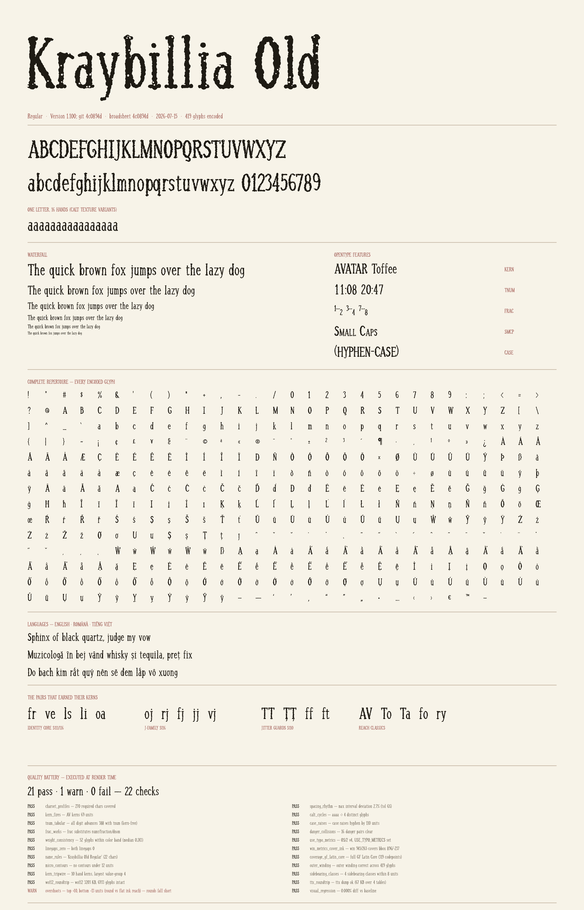
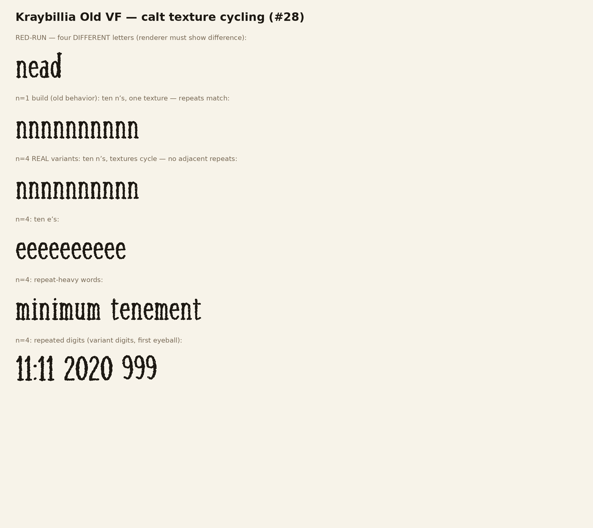
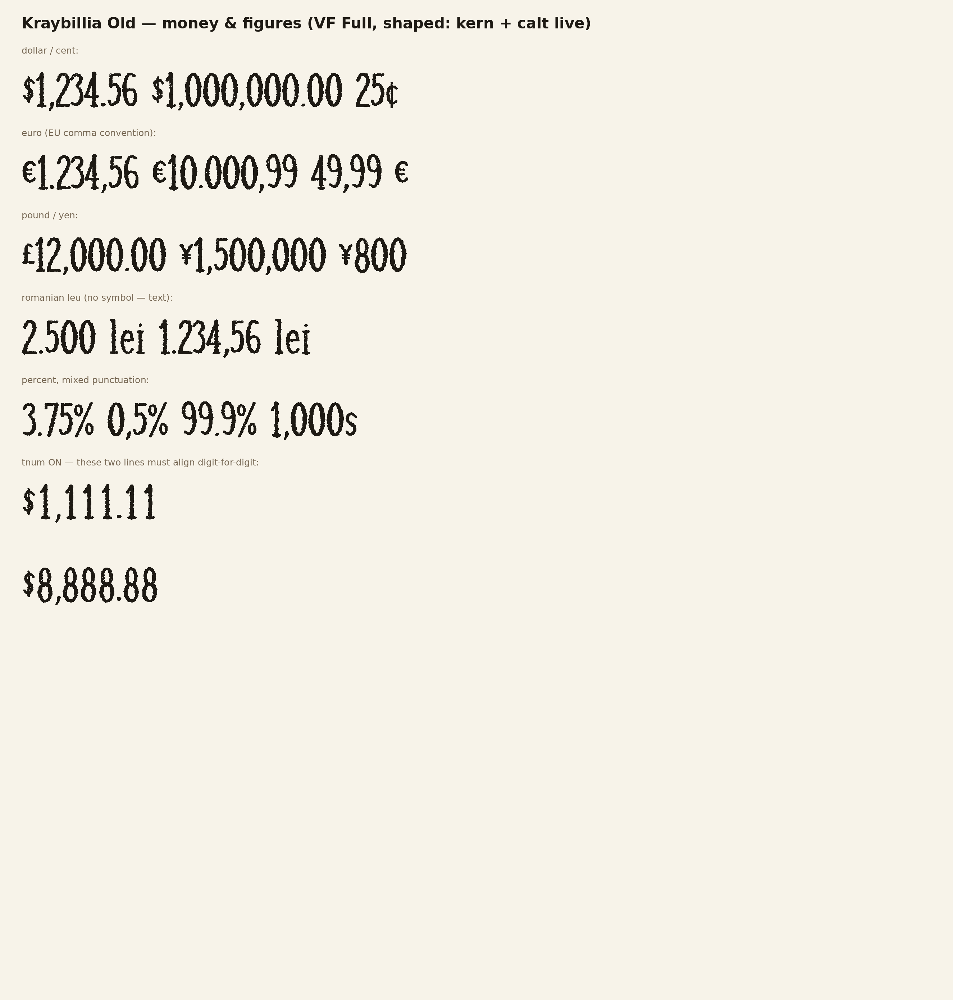

# Kraybillia Fonts

Hand-daubed display typefaces by **JK (Jeremy Kraybill) + Gordo** —
the public release side of a private parametric foundry. Every glyph
is drawn by a seeded pen: sixteen independent renders per letter,
cycled by contextual alternates so no two neighbours ever match.

**Status: pre-release.** The repository is private while the first
public cut is prepared.

---

## Kraybillia Old

A daub-pen display family with an unsettled, hand-inked texture —
deliberately so.

### Tiers

| Tier | Files | What it is |
|---|---|---|
| **Statics** | `KraybilliaOld-{Regular,Bold,Italic,BoldItalic}.otf` | The texture flagship — 16-way calt cycling, full optical kerning |
| **Variable** | `KraybilliaOldVF.ttf` | Lean axes build: `wght` 400–700, `opsz` 12–72 (texture calms at text sizes) |
| **Variable Full** | `KraybilliaOldVFFull.ttf` | The axes *plus* real 4-way texture cycling — desktop specialty |
| **Web** | `.woff2` of every tier | The [specimen site](docs/index.html) is set in them |

### Texture, honestly

The lean VF trades cycling for size — repeats match by design.
Statics and VF Full carry the cycle. Every daub is placed by a
deterministic seeded pen: rebuilds are byte-identical, texture is
reproducible, nothing is rubber-stamped.

### Coverage

Full **Google Fonts Latin Core** (419 encoded characters): English,
Romanian and Vietnamese at the heart — comma-below Ș ț, the complete
tone-mark system — plus Central European, Baltic, Turkish, Welsh and
Icelandic. Æ ð Þ ß Œ ł Ħ drawn with the same pen, not borrowed.
Tabular figures, fractions, small caps, case punctuation.

### Provenance

Every binary bakes its version **and the exact git commit that built
it** into name ID 5 (`Version 1.100; git <sha>`). Releases pass a
gate battery modelled on the Google Fonts onboarding profile —
fontspector clean, optical-kerning tripwires, per-glyph gap checks,
visual regression against blessed baselines, Windows-metrics ink
coverage — before any artifact is promoted here.

---

## License

All fonts are licensed under the
[SIL Open Font License 1.1](https://openfontlicense.org).
**"Kraybillia" is a Reserved Font Name.**

*Built by a human–AI collaboration: JK's eye, Gordo's pen, and a
constitution between them.*
