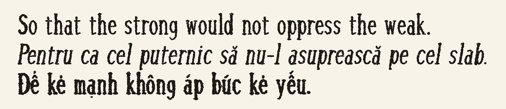
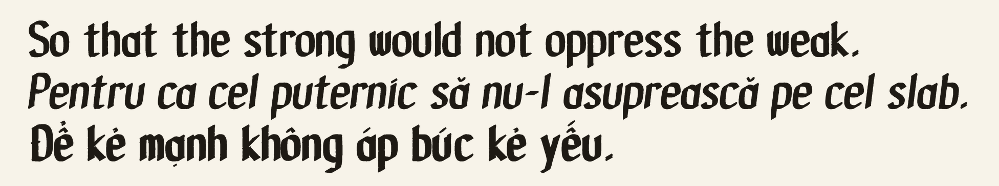

# Fonts

Some free fonts you can use. **[Preview and download](https://jkraybill.github.io/fonts/)**

## Kraybillia Old

## Kraybillia Medieval

---

Licensed under the [SIL Open Font License 1.1](https://openfontlicense.org).
Built by [jkraybill](https://github.com/jkraybill) and [gordo-ai](https://github.com/gordo-ai).
